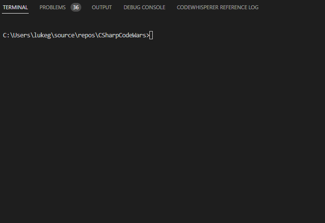

<h1 align="center">CodeWars Kata Solutions C#</h1>

## Overview
This repo contains Kata solutions written in C#. It also contains a code generator to make implementing solutions faster and consistent.

## My profile
[](https://www.codewars.com/users/LukeGarrigan)


## How to use the code generator
```
dotnet run --project .\CodeWarsCodeGen
```



This will create a class and a test project:

```csharp
using System;

namespace CSharpCodeWars.Kyu6.ConvertToCamel;

public class ConvertToCamel
{
    public string Convert(List<string> arg1)
    {
         return "";
    }
}
```

```csharp
using NUnit.Framework;
using FluentAssertions;

namespace CSharpCodeWars.Kyu6.ConvertToCamel;

public class ConvertToCamelTests
{
      private ConvertToCamel _sut;
      
      [SetUp]
      public void Setup()
      {
          _sut = new ConvertToCamel();
      }

      [Test]
      public void Test1()
      {
          
      }
}
```

Placing them in the same folder for speed. 

